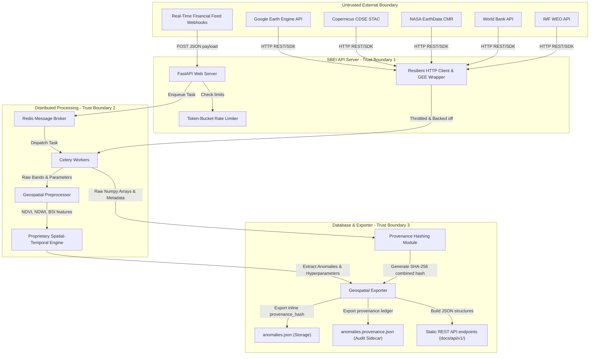

# DATA FLOW DIAGRAM (DFD) SPECIFICATION: SBEI PLATFORM

**Author:** Chief Information Security Officer & Technical Co-Founder  
**Classification:** Confidential (YC Due Diligence Draft)  
**Standard:** Structured Data Flow Diagram (DFD) / Threat Model Layout  

---

## 1. Overview
This document specifies the data flows, trust boundaries, processing nodes, and cryptographic validation gates for the Space-Based Economic Intelligence (SBEI) platform.

---

## 2. Mermaid Data Flow Diagram

---

## 3. Trust Boundaries & Security Classifications

### 3.1 Trust Boundary 0 (External Entities)
- **Entities**: GEE API, Copernicus catalogue, NASA CMR, World Bank portal, IMF endpoints.
- **Threat Vector**: Man-in-the-Middle (MitM) attacks, API key theft, rate-limiting locks, or provider outages.
- **Control**: All external requests are routed through the `ResilientHTTPClient` using TLS 1.3, custom authentication OAuth2, rate-limiting token buckets, and exponential backoff retry policies.

### 3.2 Trust Boundary 1 (SBEI REST API Server)
- **Entities**: FastAPI Server, webhook endpoints.
- **Threat Vector**: SQL injection, Cross-Site Scripting (XSS), Denial of Service (DoS) from oversized payloads.
- **Control**: Webhooks validate payloads using strict Pydantic schemas, and are tested via the automated DAST fuzzer (`fuzz_api.py`).

### 3.3 Trust Boundary 2 (Distributed Task Processing)
- **Entities**: Redis, Celery Workers, Geospatial Preprocessor, Spatial-Temporal Engine.
- **Threat Vector**: Unauthorized task injection, memory leaks during concurrent NumPy array calculations, worker crashes.
- **Control**: Task structures are serialized exclusively in strict JSON format. Worker execution has a hard 5-minute timeout threshold per tile.

### 3.4 Trust Boundary 3 (Data Storage & Provenance Ledger)
- **Entities**: Geospatial Exporter, anomalies database.
- **Threat Vector**: Log tampering, evidence spoofing, historical data alteration.
- **Control**: Immutable SHA-256 combined hashing processes the exact array inputs and hyperparameters. Any modification of raw satellite tiles or parameters breaks the hash validation chain, ensuring defensible evidence for institutional banking compliance reviews.
